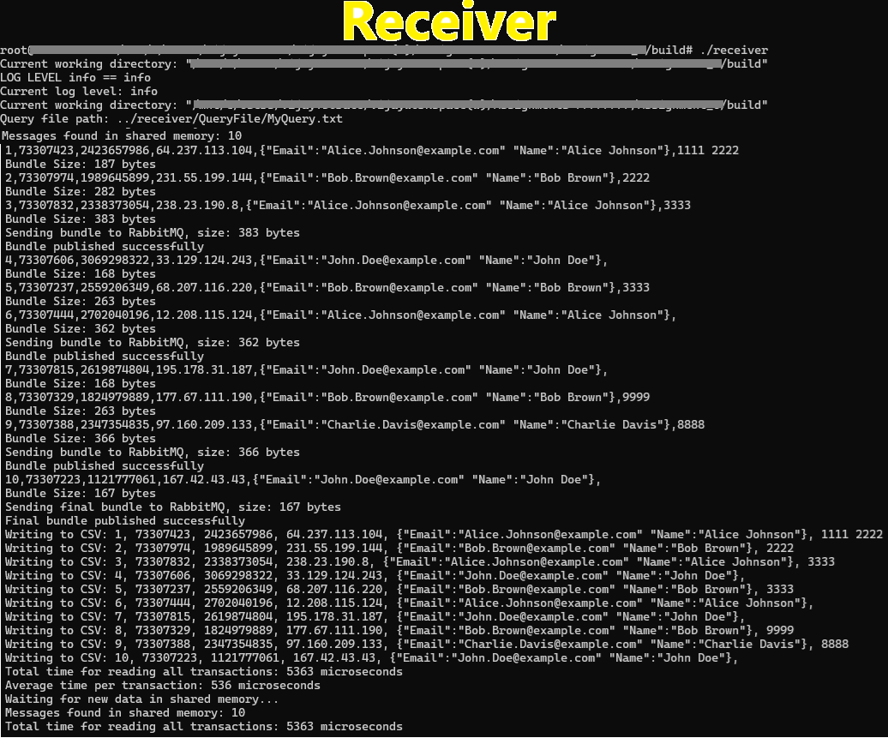
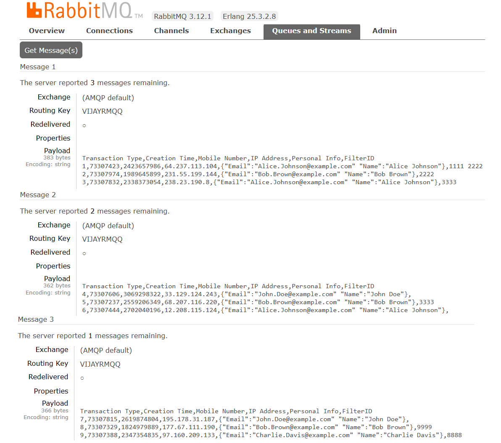

---

# RabbitMQTransactionBundlerFilterer

## Project Description
The RabbitMQTransactionBundlerFilterer project handles serialization and deserialization of transaction messages with advanced features like data filtering and integrity validation. Messages are processed, filtered based on custom queries, and transmitted to RabbitMQ (RMQ) in a structured format. This project also supports configurable options such as bundle size, timeout, and local debugging with CSV dumps for enhanced flexibility and troubleshooting.

## Technology and Frameworks Used
- **C++17**: Core programming language.
- **Boost Libraries**: For shared memory management, containers, and CRC computation.
- **RabbitMQ**: Message queuing and handling.
- **nlohmann/json**: JSON serialization and deserialization.
- **spdlog**: Logging.
- **CMake**: Build configuration.

## Project Structure
```
.
├── CMakeLists.txt
├── README.md
├── build
│   ├── dumppp.csv
│   ├── log
│   │   ├── receiver_log.txt
│   │   └── sender_log.txt
│   ├── receiver
│   └── sender
├── common
│   ├── include
│   │   ├── config.h
│   │   └── logger.h
│   └── src
│       ├── config.cpp
│       └── logger.cpp
├── config
│   └── values.config
├── lib
│   ├── Boost_Headers
│   ├── Boost_Libraries
│   ├── nlohmann_Json_Header
│   ├── RabbitMQ_Headers
│   ├── RabbitMQ_Libraries
│   ├── spdlog
│   └── spdlog_Libraries
├── messageclass
│   ├── src
│   │    └── UserMessages_Data.h
│   ├── QueryFile
│   │    └── MyQuery.txt
├── receiver
│   └── src
│       └── receiver.cpp
└── sender
    └── src
        └── sender.cpp
```

## Project Images
- Sender <BR><BR>

<BR><BR>
- Receiver<BR><BR>

<BR><BR>
- RabbitMQ<BR><BR>

<BR><BR>
- CSV Query Filter Dump<BR><BR>

<BR><BR>
- Receiver Log<BR><BR>

<BR><BR>
- Sender Log<BR><BR>

<BR><BR>

## Steps to Run the Project

### Clone the Repository:
```sh
git clone <repository-url>
cd <repository-directory>
```

### Build the Project:
```sh
mkdir build
cd build
cmake ..
make
```

### Configure the Project:
- Edit the `config/values.config` file to set desired configuration values (e.g., shared memory size, bundle size, RabbitMQ queue name, etc.).
- Prepare your filter queries in the `messageclass/QueryFile/MyQuery.txt` file.

### Run the Sender:
```sh
./sender
```

### Run the Receiver:
```sh
./receiver
```

## Configuration File (values.config)
The configuration file includes:
- `LOGGER_LEVEL_SETTT  info`: Logging level set to info.
- `DATA_BULK_COUNT  10`: Number of messages generated in bulk.
- `NAME_SHARED_MEMORY SharedMemory1`: Shared memory segment name.
- `SHARED_MEMORY_SIZE 655377`: Size of the shared memory segment.
- `LOG_TIMER_RECEIVER 1`: Logging interval in the receiver.
- `NAME_RABBIT_MQ VIJAYRMQQ`: RabbitMQ queue name.
- `DEBUGGING_MODE true`: Enable debugging.
- `DUMP_CSV_FILE_NAME CSV_QUERY_FILTER_DUMP.csv`: CSV file name for dumping messages.
- `BUNDLE_SIZE 300`: Maximum size of a message bundle.
- `QUERY_FILE_NAME MyQuery.txt`: Name of the file containing filtering queries.

## Filtering Queries (MyQuery.txt)
The filtering system supports three types of queries:
- **AND Query**: All conditions must be satisfied.
- **OR Query**: At least one condition must be satisfied.
- **BOTH Query**: A combination of AND and OR conditions.

### Example Query File:
```
# AND query
ID 1111
ismobile 2423657986
isIP 64.237.113.104

# AND query
ID 1000
ismobile 2423657986
isIP 64.237.113.000

# OR query
ID 2222
ismobile 2423657986 , isIP 231.55.199.144

# OR query
ID 3333
ismobile 2559206349 , isIP 238.23.190.8

# Both AND and OR query
ID 9999
ismobile 1824979889
isIP 177.67.111.190 , isTTY 88

# Both AND and OR query
ID 8888
ismobile 2347354835
isIP 177.67.111.190 , isTTY 9

# Both AND and OR query
ID 8000
ismobile 2347354835
isIP 177.67.111.190 , isTTY 88a
```

## Technical Details

### Functions and Their Purpose

#### UserMessages_Data.h
**Serialization and Shared Memory Management**:
- Fields include `transaction_type`, `creation_time`, `mobile_number`, `ip_address`, `personal_identifier_info`, `checksum`, and `filter_id`.
- Adds serialization capabilities for compatibility with shared memory and JSON.

**Functions**:
- `template<class Archive> void save(Archive& ar, const ShmemString& str, const unsigned int version)`: Custom serialization for `ShmemString`.
- `template<class Archive> void load(Archive& ar, ShmemString& str, const unsigned int version)`: Custom deserialization for `ShmemString`.
- `template<class Archive> void serialize(Archive& ar, ShmemString& str, const unsigned int version)`: Splits serialization and deserialization for `ShmemString`.
- `template<class Archive> void save(Archive& ar, const ShmemMap& map, const unsigned int version)`: Custom serialization for `ShmemMap`.
- `template<class Archive> void load(Archive& ar, ShmemMap& map, const unsigned int version)`: Custom deserialization for `ShmemMap`.
- `template<class Archive> void serialize(Archive& ar, ShmemMap& map, const unsigned int version)`: Splits serialization and deserialization for `ShmemMap`.
- `template <class Archive> void serialize(Archive& ar, const unsigned int version)`: Serialization function for `UserMessages_Data`.
- `std::ostream& operator<<(std::ostream& os, const ShmemString& str)`: Custom output operator for `ShmemString`.
- `std::ostream& operator<<(std::ostream& os, const std::pair<const ShmemString, ShmemString>& p)`: Custom output operator for `std::pair` containing `ShmemString`.

#### sender.cpp
**Functions**:
- `generate_random_mobile_number()`: Generates a random 10-digit mobile number.
- `generate_random_ip_address()`: Generates a random IP address.
- `generate_random_creation_time()`: Generates a random timestamp.
- `generate_random_name()`: Generates a random name.
- `generate_random_email(const std::string& name)`: Generates a random email.
- `compute_crc(const UserMessages_Data& msg)`: Computes the CRC checksum for a message.
- `log_transaction_times(const std::vector<std::chrono::microseconds>& times)`: Logs total and average transaction times.

**Purpose**:
- Generates and writes messages with random attributes to shared memory.
- Calculates CRC checksums to ensure data integrity.

#### receiver.cpp
**Functions**:
- `compute_crc(const UserMessages_Data& msg)`: Verifies the integrity of received messages.
- `QueryFilter::match_query(UserMessages_Data& msg) const`: Matches messages against filtering rules from `MyQuery.txt`.
- `QueryFilter::printQuery() const`: Prints the loaded queries for debugging.
- `QueryFilter::load_queries(const std::string& query_file_path)`: Loads queries from the specified file.
- `read_and_log_messages(bip::managed_shared_memory& segment, std::vector<std::chrono::microseconds>& read_times, size_t& last_processed_index, std::vector<UserMessages_Data>& message_bundle, const QueryFilter& query_filter)`: Reads messages from shared memory, verifies their checksums, and applies filters.
- `dump_to_csv(const std::vector<UserMessages_Data>& messages, const std::string& filename)`: Saves messages to a CSV file for debugging.
- `send_to_rabbitmq(const std::vector<UserMessages_Data>& messages, const std::string& queue_name, const std::string& max_bundle_size_allowed)`: Sends filtered and bundled messages to RabbitMQ.

**Purpose**:
- Reads, verifies, and filters messages from shared memory.
- Sends filtered messages to RabbitMQ and logs activity.

## Goals and What I Learned

### Goals
- Implement robust serialization and deserialization of transaction messages.
- Add advanced filtering based on AND, OR, and BOTH conditions.
- Ensure data integrity with CRC checksums.
- Efficiently bundle and transmit messages to RabbitMQ.
- Provide debugging tools via CSV dumps.

### What I Learned
- Using Boost for shared memory management and CRC computation.
- Filtering logic based on dynamic query conditions.
- JSON serialization/deserialization with nlohmann/json.
- RabbitMQ integration for message queuing.
- Logging with spdlog.
- Building complex projects with CMake.
- Concurrency and Synchronization: Managing concurrent access to shared memory and ensuring thread safety.
- Error Handling: Implementing robust error handling mechanisms to manage exceptions and ensure smooth operation.
- Performance Optimization: Techniques to optimize the performance of message processing and transmission.
- Configuration Management: Creating and managing configuration files to allow flexible and dynamic project settings.
- Debugging and Testing: Using various debugging and testing tools to ensure the reliability and correctness of the project.

---

